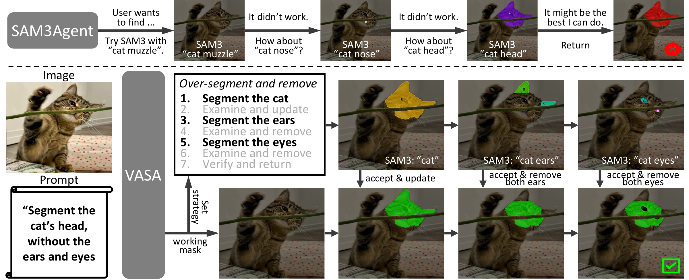
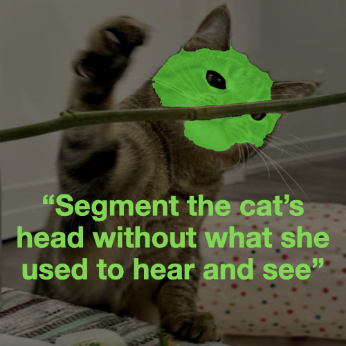
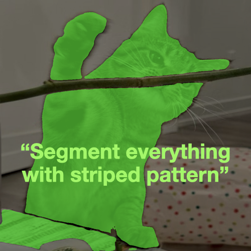
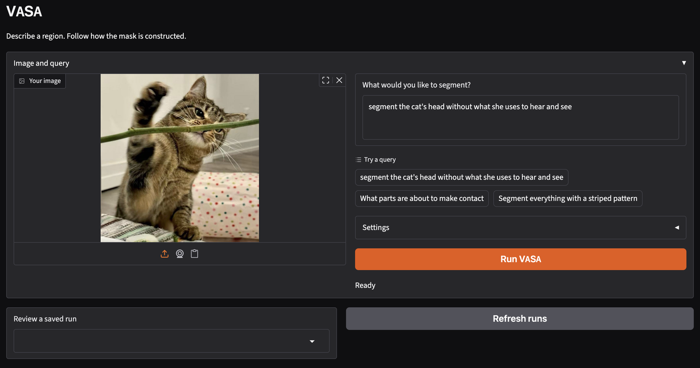
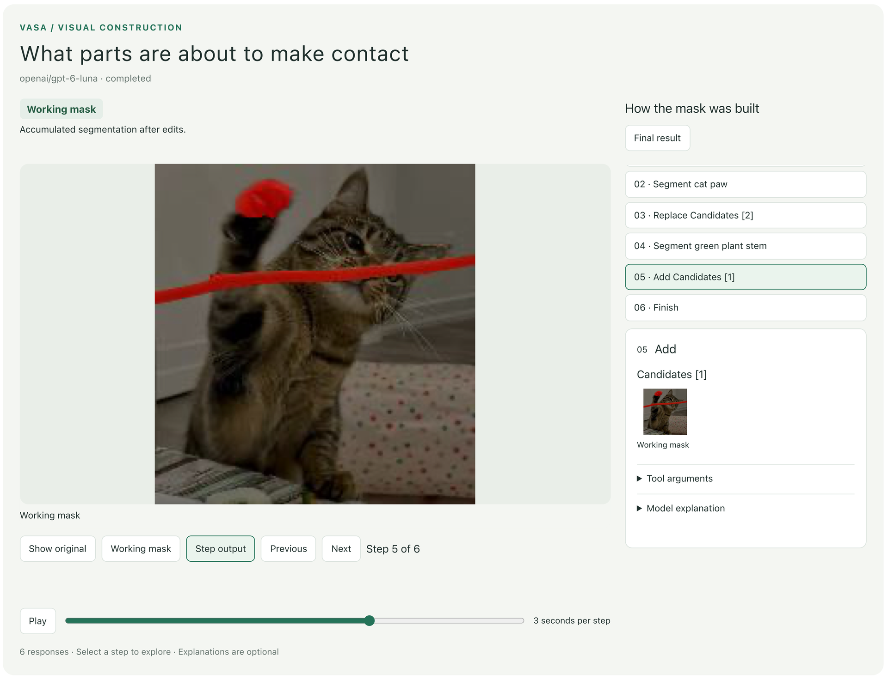

# VASA: Vision Harnessing Agent for Open Ad-hoc Segmentation

**University of Michigan**

[Zilin Wang](https://wayne2wang.github.io/), [Stella X. Yu](https://web.eecs.umich.edu/~stellayu/)

[[Paper](https://arxiv.org/abs/2605.19410)] [[Setup](#setup)] [[Quick Start](#quick-start)] [[Gradio](#gradio)] [[Citation](#citation)]

**TL;DR:** VASA is a training-free **vision harnessing agent for open ad-hoc segmentation**: segmenting concepts defined on the fly through parts, relations, exclusions, and collections. Its visual harness coordinates a VLM and SAM3 to construct the requested mask, making visual progress **persistent, inspectable, and editable**. Planning, segmentation, mask editing, scrutiny, and error recovery let reasoning and visual construction advance together.

<p align="left"></p>

## Setup

VASA has two parts:

- **SAM3** runs locally to generate segmentation masks.
- **A vision-language model (VLM)** guides the process. Start with **OpenRouter**, or host your own VLM with **vLLM**.

### 1. Install SAM3 and VASA

```bash
git clone https://github.com/Wayne2Wang/VASA.git && cd VASA
```

For Linux with an NVIDIA GPU:

```bash
conda create -n vasa python=3.12 pip -y
conda activate vasa
python -m pip install "torch>=2.7" "torchvision>=0.22" --index-url https://download.pytorch.org/whl/cu126
python -m pip install -r requirements.txt
```

<details>
<summary><strong>Using a Mac (Apple Silicon)?</strong></summary>

Use this environment setup instead:

```bash
CONDA_SUBDIR=osx-arm64 conda create -n vasa-arm python=3.12 pip -y
conda activate vasa-arm
conda config --env --set subdir osx-arm64
python -m pip install -r requirements.txt
```

Add `--device cpu` when running the examples. We apply the CPU compatibility adjustments automatically.

</details>

<br>

Then install SAM3 in the same environment:

```bash
python -m pip install "git+https://github.com/facebookresearch/sam3.git@2345a4ad109ac29c569da749c91d84f10dc08c40"
```

Request access to the [SAM3 checkpoint](https://huggingface.co/facebook/sam3), then sign in:

```bash
hf auth login
```

The checkpoint downloads automatically on your first run. See the [official SAM3 instructions](https://github.com/facebookresearch/sam3#installation) if installation needs adjustments for your machine.

### 2. Connect a VLM

We recommend starting with `openai/gpt-5.6-luna`/`z-ai/glm-5.3-flash` as the default due to the cost-effectiveness. All models we tested include (in performance order):

* `google/gemini-2.5-flash-lite` (≈$0.0158/query)
* `Qwen/Qwen3-VL-32B-Thinking` (≈$0.0156/query; local vLLM)
* `openai/gpt-5.6-luna` (≈$0.0124/query)
* `openai/gpt-6-luna` (≈$0.0054/query)
* `z-ai/glm-5.3-flash` (≈$0.0045/query, under low reasoning effort)
* `deepseek/deepseek-v4.1-flash` (≈$0.0213/query)


**Option 1: API calls (usually paid).** Get an API key from [OpenRouter](https://openrouter.ai/keys) or directly from an official provider, then copy the configuration:

```bash
cp .env.example .env
```

Edit `.env` with your API key. The example uses `openai/gpt-6-luna`:

```dotenv
VASA_BASE_URL=https://openrouter.ai/api/v1
VASA_MODEL=openai/gpt-6-luna
VASA_API_KEY=YOUR_API_KEY
```

The demo loads `.env` automatically. Images and queries are sent to your selected provider, and API usage is billed by that provider.


**Option 2: host the VLM with vLLM** On a GPU server, install [vLLM](https://docs.vllm.ai/en/latest/getting_started/quickstart/) in a separate environment and serve a supported vision-language model. For example:

```bash
pip install vllm
vllm serve Qwen/Qwen3-VL-32B-Thinking --host 127.0.0.1 --port 8000
```

Point VASA's `.env` to that server:

```dotenv
VASA_BASE_URL=http://localhost:8000/v1
VASA_MODEL=Qwen/Qwen3-VL-32B-Thinking
VASA_API_KEY=EMPTY
```

This example uses `Qwen/Qwen3-VL-32B-Thinking` and assumes VASA runs on the same server. See [vLLM's serving guide](https://docs.vllm.ai/en/latest/serving/openai_compatible_server/) for other deployments.

## Quick start

Try these three queries on `examples/pipi.png`. The original image and example outputs are shown below.

<table>
  <tr>
    <th>Input image</th>
    <th>Head with exclusions</th>
    <th>Anticipated contact</th>
    <th>Striped regions</th>
  </tr>
  <tr>
    <td width="25%" align="center"></td>
    <td width="25%" align="center"></td>
    <td width="25%" align="center"></td>
    <td width="25%" align="center"></td>
  </tr>
</table>

**1. Try the example queries**

```bash
python demo.py --image examples/pipi.png \
  --query "segment the cat's head without what she uses to hear and see" \
  --output outputs/head

python demo.py --image examples/pipi.png \
  --query "What parts are about to make contact" \
  --output outputs/contact

python demo.py --image examples/pipi.png \
  --query "Segment everything with a striped pattern" \
  --output outputs/stripes
```

**2. Or provide your own image and query**

```bash
python demo.py --image /path/to/image.jpg \
  --query "The parts of the object that match my description" \
  --output outputs/my-image
```

The examples use CUDA by default. Use `--device cpu` on Mac or a CPU-only machine.

Omit `--output` to automatically save each run in `outputs/` with a shortened image name, query, timestamp, and unique ID. Repeating an image and query creates a new run. An explicit `--output` directory must be empty.

Each run saves `mask.png`, `overlay.png`, and a `result.json` summary. Traces are saved by default: `input.png` preserves the input image, `trace/sam_out/` contains intermediate masks and candidate records, and `trace/history.json` records the agent's conversation, tool calls, and image references relative to the output folder. Open `trace.html` for an offline walkthrough with tool calls, intermediate images, and expandable model explanations. The HTML embeds its images, so it can be shared as one file. Use `--no-trace` to skip trace saving.


## Gradio

```bash
python app.py
```

Open the printed local URL, upload an image, pick or type a query, and click **Run VASA**. VLM settings come from `.env`; SAM3 uses CUDA when available, otherwise CPU.

<table>
  <tr>
    <th>Image and query</th>
    <th>Step-by-step review</th>
  </tr>
  <tr>
    <td width="50%" align="center"></td>
    <td width="50%" align="center"></td>
  </tr>
</table>

The page follows the run live, lets you step through tool calls and optional explanations, and saves each result under `outputs/`. Reopen past runs from the dropdown or download the mask, overlay, or offline HTML report (same viewer as `trace.html`).

## Citation

```bibtex
@misc{wang2026visionharnessingagentopen,
  title={Vision Harnessing Agent for Open Ad-hoc Segmentation},
  author={Zilin Wang and Stella X. Yu},
  year={2026},
  eprint={2605.19410},
  archivePrefix={arXiv},
  primaryClass={cs.CV},
  url={https://arxiv.org/abs/2605.19410}
}
```

## License

VASA code in this repository is released under the [MIT License](LICENSE), except for SAM3-derived components described below.

## Acknowledgments

VASA builds on [SAM3](https://github.com/facebookresearch/sam3) and its agent and visualization utilities. The controller (`src/engine/agent_core.py`), visualization code (`src/engine/viz.py`), and helpers (`src/engine/helpers/`) include SAM3-derived code with local modifications. Original Meta Platforms copyright notices are retained in the source files.

SAM3 code and weights remain external dependencies. This implementation uses SAM3 revision `2345a4ad109ac29c569da749c91d84f10dc08c40`.
